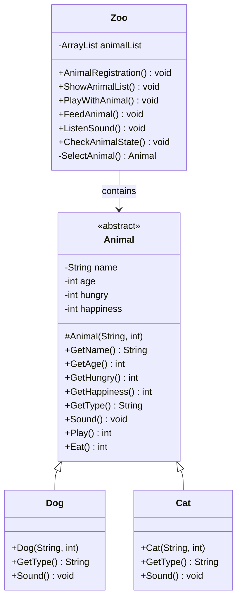

```mermaid
classDiagram
    Zoo --> Animal : contains
    Animal <|-- Dog
    Animal <|-- Cat

    class Zoo {
        -ArrayList<Animal> animalList
        +AnimalRegistration() void
        +ShowAnimalList() void
        +PlayWithAnimal() void
        +FeedAnimal() void
        +ListenSound() void
        +CheckAnimalState() void
        -SelectAnimal() Animal
    }

    class Animal {
        <<abstract>>
        -String name
        -int age
        -int hungry
        -int happiness
        #Animal(String, int)
        +GetName() String
        +GetAge() int
        +GetHungry() int
        +GetHappiness() int
        +GetType() String
        +Sound() void
        +Play() int
        +Eat() int
    }

    class Dog {
        +Dog(String, int)
        +GetType() String
        +Sound() void
    }

    class Cat {
        +Cat(String, int)
        +GetType() String
        +Sound() void
    }

```
