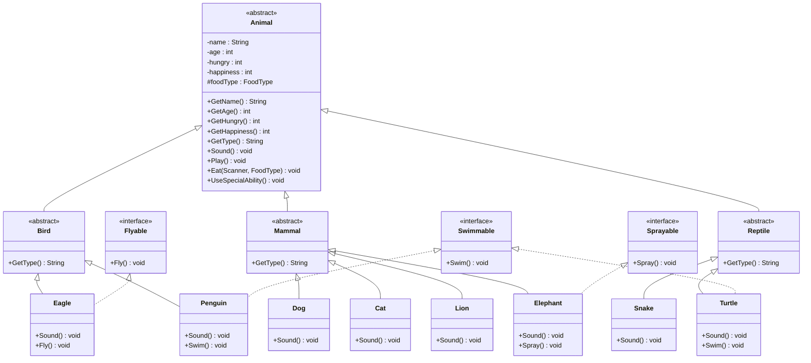

```mermaid
classDiagram

class Animal {
    <<abstract>>
    -name : String
    -age : int
    -hungry : int
    -happiness : int
    #foodType : FoodType
    +GetName() String
    +GetAge() int
    +GetHungry() int
    +GetHappiness() int
    +GetType() String
    +Sound() void
    +Play() void
    +Eat(Scanner, FoodType) void
    +UseSpecialAbility() void
}

class Bird {
    <<abstract>>
    +GetType() String
}

class Mammal {
    <<abstract>>
    +GetType() String
}

class Reptile {
    <<abstract>>
    +GetType() String
}

class Dog {
    +Sound() void
}

class Cat {
    +Sound() void
}

class Lion {
    +Sound() void
}

class Elephant {
    +Sound() void
    +Spray() void
}

class Eagle {
    +Sound() void
    +Fly() void
}

class Penguin {
    +Sound() void
    +Swim() void
}

class Snake {
    +Sound() void
}

class Turtle {
    +Sound() void
    +Swim() void
}

class Flyable {
    <<interface>>
    +Fly() void
}

class Swimmable {
    <<interface>>
    +Swim() void
}

class Sprayable {
    <<interface>>
    +Spray() void
}

Animal <|-- Bird
Animal <|-- Mammal
Animal <|-- Reptile

Bird <|-- Eagle
Bird <|-- Penguin

Mammal <|-- Dog
Mammal <|-- Cat
Mammal <|-- Lion
Mammal <|-- Elephant

Reptile <|-- Snake
Reptile <|-- Turtle

Flyable <|.. Eagle
Swimmable <|.. Penguin
Swimmable <|.. Turtle
Sprayable <|.. Elephant

```
